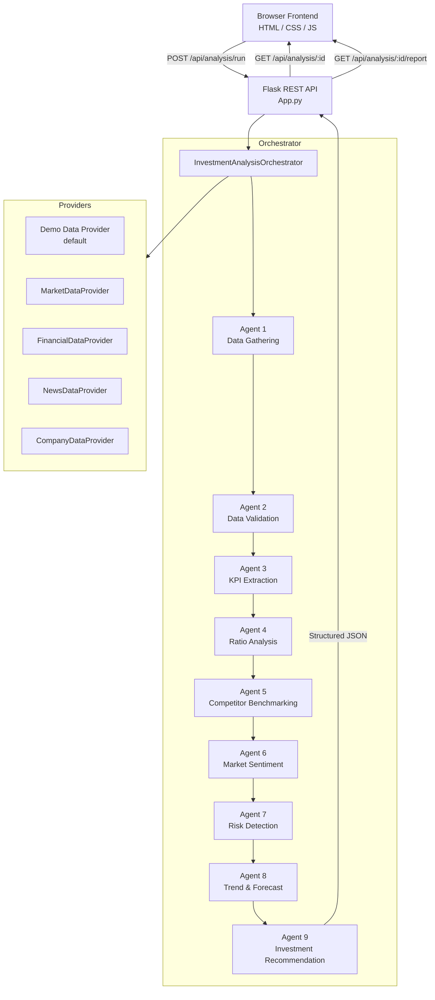

# InvestIQ — Sequential AI Investment Analyst

> **A production-quality full-stack web application demonstrating a Sequential Task Agent for investment analysis.**


---

## 📋 Project Overview

**InvestIQ** is a full-stack AI-powered Sequential Task Agent that automates the workflow of an investment analyst.

The system executes a 9-stage sequential pipeline:

```
User Input → Data Gathering → Data Validation → KPI Extraction → Ratio Analysis
          → Competitor Benchmarking → Sentiment Analysis → Risk Detection
          → Trend & Forecast → Investment Recommendation → Structured Report
```

Each stage depends on the output of the previous stage. The full pipeline is visible to the user in real time.

---

## 🏗️ Architecture



---

## ✨ Features

| Feature | Description |
|---|---|
| **Sequential 9-Stage Pipeline** | Each agent consumes the previous stage's output |
| **Real-time Progress UI** | Watch each agent execute step-by-step |
| **Demo Data Mode** | Fully functional without any API keys |
| **KPI Dashboard** | 12+ financial KPIs with trend indicators |
| **Interactive Charts** | Price, Revenue, Margins, EPS, ROE, Competitor comparisons |
| **Financial Ratio Analysis** | Profitability, Liquidity, Leverage, Valuation, Growth — with interpretations |
| **Competitor Benchmarking** | Weighted scoring against 3–5 peers |
| **Market Sentiment** | News classification with topic analysis |
| **Risk Detection** | 10 risk categories with severity, evidence and impact |
| **Trend & Forecast** | Explainable trend analysis with bullish/bearish factors |
| **Investment Recommendation** | STRONG BUY / BUY / HOLD / UNDERWEIGHT / SELL with confidence % |
| **Agent Trace** | Expandable developer trace showing each agent's input/output |
| **HTML Report** | Full downloadable investment report (print to PDF) |
| **Responsive Design** | Desktop, tablet and mobile |

---

## 📁 Project Structure

```
investiq/
├── App.py                          # Flask application entry point
├── requirements.txt                # Python dependencies
├── .env                            # Environment variables (never commit secrets)
│
├── backend/
│   ├── orchestrator.py             # InvestmentAnalysisOrchestrator
│   ├── agents/
│   │   ├── agent1_data_gathering.py
│   │   ├── agent2_data_validation.py
│   │   ├── agent3_kpi_extraction.py
│   │   ├── agent4_ratio_analysis.py
│   │   ├── agent5_competitor_benchmarking.py
│   │   ├── agent6_sentiment_analysis.py
│   │   ├── agent7_risk_detection.py
│   │   ├── agent8_trend_analysis.py
│   │   └── agent9_recommendation.py
│   ├── providers/
│   │   ├── __init__.py             # Provider abstraction layer
│   │   └── demo_data.py            # Demo data (AAPL, MSFT, GOOGL, TSLA, AMZN)
│   ├── routes/
│   │   └── api.py                  # REST API endpoints
│   └── services/
│       └── report_generator.py     # HTML report generation
│
└── frontend/
    ├── templates/
    │   └── index.html              # Single-page application shell
    └── static/
        ├── css/
        │   └── Style.css           # Full design system
        └── js/
            └── app.js              # Application logic + charts
```

---

## 🚀 Quick Start

### Prerequisites

- Python 3.10 or higher
- pip

### Installation

```bash
# Clone / navigate to the project
cd investiq

# Create a virtual environment (recommended)
python -m venv venv

# Activate virtual environment
# Windows:
venv\Scripts\activate
# macOS/Linux:
source venv/bin/activate

# Install dependencies
pip install -r requirements.txt
```

### Running the Application

```bash
# Start the server (from the investiq/ directory)
python App.py
```

Open your browser at: **http://localhost:5000**

### Demo Mode (Default)

The application works **without any API keys** in Demo Mode.

- Demo data is provided for: **AAPL, MSFT, GOOGL, TSLA, AMZN**
- All demo data is clearly labeled in the UI
- The full 9-stage pipeline executes with realistic data

---

## 🔑 Environment Variables

Copy `.env` and configure as needed:

| Variable | Required | Description |
|---|---|---|
| `PORT` | No | Server port (default: 5000) |
| `FLASK_DEBUG` | No | Enable debug mode (default: false) |
| `SECRET_KEY` | Recommended | Flask secret key |
| `MARKET_DATA_API_KEY` | No | Stock price API key |
| `FINANCIAL_DATA_API_KEY` | No | Fundamental data API key |
| `NEWS_API_KEY` | No | News API key |

> If API keys are not configured, the application automatically falls back to Demo Data Mode.

---

## 🌐 API Documentation

### Endpoints

| Method | Endpoint | Description |
|---|---|---|
| `GET` | `/api/health` | Health check |
| `GET` | `/api/companies` | List available demo companies |
| `GET` | `/api/company/:ticker` | Company metadata |
| `GET` | `/api/company/:ticker/financials` | Financial data |
| `GET` | `/api/company/:ticker/news` | News headlines |
| `GET` | `/api/company/:ticker/competitors` | Competitor data |
| `POST` | `/api/analysis/run` | Start a new analysis |
| `GET` | `/api/analysis/:id` | Get analysis result |
| `GET` | `/api/analysis/:id/progress` | Get pipeline progress |
| `GET` | `/api/analysis/:id/report?format=html` | Download HTML report |

### Analysis Request

```json
POST /api/analysis/run
{
  "ticker": "AAPL",
  "period": "5y"
}
```

### Analysis Response (abbreviated)

```json
{
  "id": "uuid",
  "ticker": "AAPL",
  "status": "completed",
  "is_demo": true,
  "company": { "name": "Apple Inc.", "sector": "Technology" },
  "data_quality": 94,
  "kpis": {
    "revenue": { "value": 383285.0, "unit": "M USD" },
    "eps": { "value": 6.13, "trend": "stable" }
  },
  "sentiment": { "score": 72, "label": "Positive" },
  "risk": { "score": 38, "level": "Moderate" },
  "forecast": { "outlook": "Bullish", "confidence": 74 },
  "recommendation": { "action": "BUY", "score": 78, "confidence": 82 },
  "agent_trace": [...]
}
```

---

## 🤖 Agent Pipeline

### Agent 1 — Data Gathering
Collects company info, multi-year financials, stock price history, news headlines and competitor data. Creates a normalized unified data object.

### Agent 2 — Data Validation
Validates completeness, ratio sanity, data freshness, currency consistency. Generates a **Data Quality Score (0–100)**.

### Agent 3 — KPI Extraction
Extracts and normalizes 20+ KPIs with trend labels (improving/deteriorating/stable) and historical series for charting.

### Agent 4 — Financial Ratio Analysis
Calculates ratios across 5 categories (Profitability, Liquidity, Leverage, Valuation, Growth) with **plain-English interpretations**.

### Agent 5 — Competitor Benchmarking
Compares the company against 3–5 peers using a **configurable weighted scoring model** across 7 metrics. Assigns rank and labels (Best/Weakest).

### Agent 6 — Market Sentiment
Analyzes news headlines, classifies sentiment (positive/neutral/negative), scores from **-100 to +100**, and identifies top topics.

### Agent 7 — Risk Detection
Identifies up to 10 risk categories with **severity (Low/Moderate/High/Critical)**, evidence, impact and confidence.

### Agent 8 — Trend & Predictive Analysis
Analyzes historical trends (revenue, earnings, margin, ROE, price, sentiment), generates explainable **bullish/bearish factors** and a **confidence-scored outlook**.

### Agent 9 — Investment Recommendation
Computes a weighted investment score across 6 dimensions and outputs **STRONG BUY / BUY / HOLD / UNDERWEIGHT / SELL** with key reasons and risks.

---

## 📊 Calculation Methodology

### Investment Score Weights (configurable in `agent9_recommendation.py`)

| Dimension | Weight |
|---|---|
| Financial Health | 25% |
| Growth | 20% |
| Risk Profile | 15% |
| Valuation | 15% |
| Competitive Position | 15% |
| Market Sentiment | 10% |

### Score → Recommendation Mapping

| Score Range | Recommendation |
|---|---|
| 80–100 | STRONG BUY |
| 65–79 | BUY |
| 50–64 | HOLD |
| 35–49 | UNDERWEIGHT |
| 0–34 | SELL |

### Risk Score Mapping

| Score Range | Level |
|---|---|
| 0–25 | Low |
| 26–50 | Moderate |
| 51–75 | High |
| 76–100 | Critical |

---

## 🧪 Testing

### Run basic tests

```bash
cd investiq
python -m pytest tests/ -v  # if test files exist
```

### Manual smoke test

```bash
# Test the API health endpoint
curl http://localhost:5000/api/health

# List demo companies
curl http://localhost:5000/api/companies

# Run a demo analysis
curl -X POST http://localhost:5000/api/analysis/run \
  -H "Content-Type: application/json" \
  -d '{"ticker":"AAPL","period":"5y"}'

# Get result (replace with your analysis_id)
curl http://localhost:5000/api/analysis/{analysis_id}
```

---

## 🔒 Security Notes

- API keys are loaded from environment variables, never embedded in code
- User input is validated and sanitized (ticker regex check, max length)
- CORS is configured for development; restrict in production
- The `.env` file is listed in `.gitignore` — never commit it

---

## 🛠️ Future Improvements

- [ ] Persistent database (PostgreSQL/SQLite) for analysis history
- [ ] Real API integrations (Alpha Vantage, Financial Modeling Prep, NewsAPI)
- [ ] User authentication and portfolio tracking
- [ ] WebSocket for real-time pipeline progress (vs polling)
- [ ] DCF (Discounted Cash Flow) valuation model
- [ ] Sector-relative benchmarks
- [ ] PDF export with native Python library
- [ ] Configurable recommendation weights via UI
- [ ] Multi-currency support
- [ ] Watchlist and comparison views

---

## ⚠️ Responsible Use Disclaimer

> This application provides AI-generated analytical insights for educational and informational purposes only. It is not financial advice, and users should conduct their own research or consult a qualified financial professional before making investment decisions. Past data does not guarantee future results. All demo data is synthetic and does not represent real-time market data.

---

## 📄 License

MIT License — see LICENSE file.

---

*Built with IBM Bob · InvestIQ Sequential AI Investment Analyst*
